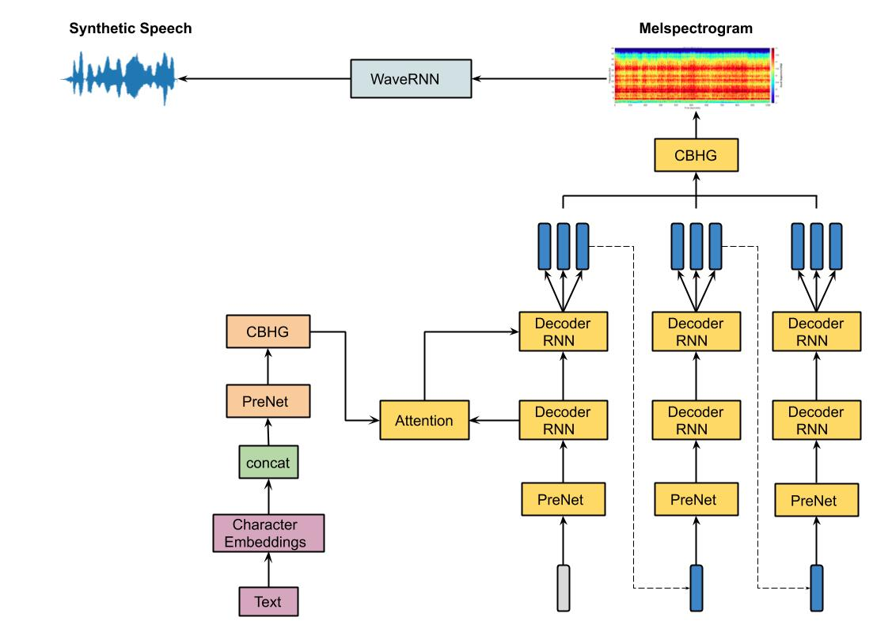
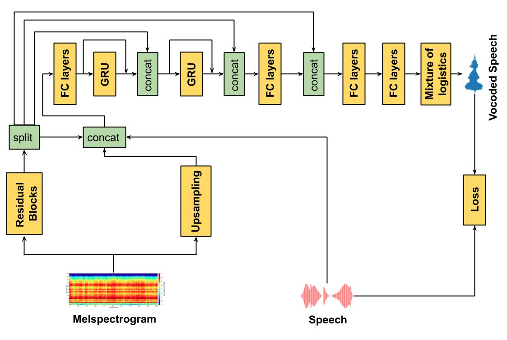

# Enhancing Speech Intelligibility in Text-To-Speech Synthesis using Speaking Style Conversion

Dipjyoti Paula,  Muhammed PV Shifasa, Yannis Pantazisb and Yannis Stylianoua

aComputer Science Department, University of Crete
bInst. of Applied and Computational Mathematics, Foundation for Research and Technology - Hellas

### Abstract: 
The increased adoption of digital assistants makes text-to-speech (TTS) synthesis systems an indispensable feature of modern mobile devices. It is hence desirable to build a system capable of generating highly intelligible speech in the presence of noise. Past studies have investigated style conversion in TTS synthesis, yet degraded synthesized quality often leads to worse intelligibility. To overcome such limitations, we proposed a novel transfer learning approach using Tacotron and WaveRNN based TTS synthesis. The proposed speech system exploits two modification strategies: (a) Lombard speaking style data and (b) Spectral Shaping and Dynamic Range Compression (SSDRC) which has been shown to provide high intelligibility gains by redistributing the signal energy on the time-frequency domain. We refer to this extension as Lombard-SSDRC TTS system. Intelligibility enhancement as quantified by the Intelligibility in Bits (SIIB-Gauss) measure shows that the proposed Lombard-SSDRC TTS system shows significant relative improvement between 110% and 130% in speech-shaped noise (SSN), and 47% to 140% in competing-speaker noise (CSN) against the state-of-the-art TTS approach. Additional subjective evaluation shows that Lombard-SSDRC TTS successfully increases the speech intelligibility with relative improvement of 455% for SSN and 104% for CSN in median keyword correction rate compared to the baseline TTS method.

# Audio Samples:
[Samples](https://www.csd.uoc.gr/~dipjyotipaul/Style-transfer-tts-IS20)

# Tacotron + WaveRNN Diagram:

# WaveRNN Diagram:

Pytorch implementation of Tarotron and WaveRNN model.

# Installation

Ensure you have:

* Python >= 3.6
* [Pytorch 1 with CUDA](https://pytorch.org/)

Then install the rest with pip:

> pip install -r requirements.txt

# Training

### Preprocessing
Download your Dataset.
* LJSpeech corpus
*  Nick Hurricane Challenge speech data (Normal and Lombard styles)
*  SSDRC-ed Nick data

Edit **hparams.py**, point **wav_path** to your dataset and run:

> python preprocess.py

or use preprocess.py --path to point directly to the dataset
___
### Train Tacotron & WaveRNN
Here's my recommendation on what order to run things:

1 - Train Tacotron with:

> python train_tacotron.py

2 - You can leave that finish training or at any point you can use:

> python train_tacotron.py --force_gta

this will force tactron to create a GTA dataset even if it hasn't finish training.

3 - Train WaveRNN with:

> python train_wavernn.py --gta

NB: You can always just run train_wavernn.py without --gta if you're not interested in TTS.

4 - Generate Sentences with both models using:

> python gen_tacotron.py wavernn

this will generate default sentences. If you want generate custom sentences you can use

> python gen_tacotron.py --input_text "this is whatever you want it to be"

And finally, you can always use --help on any of those scripts to see what options are available :)

____

### References

* [Efficient Neural Audio Synthesis](https://arxiv.org/abs/1802.08435v1)
* [Tacotron: Towards End-to-End Speech Synthesis](https://arxiv.org/abs/1703.10135)
* [Natural TTS Synthesis by Conditioning WaveNet on Mel Spectrogram Predictions](https://arxiv.org/abs/1712.05884)
* [Lombard Speech Synthesis using Transfer Learning in a TacotronText-to-Speech System](https://www.isca-speech.org/archive/Interspeech_2019/pdfs/1333.pdf) 

### Acknowlegements

* [https://github.com/fatchord/WaveRNN](https://github.com/fatchord/WaveRNN)
* [https://github.com/keithito/tacotron](https://github.com/keithito/tacotron)

